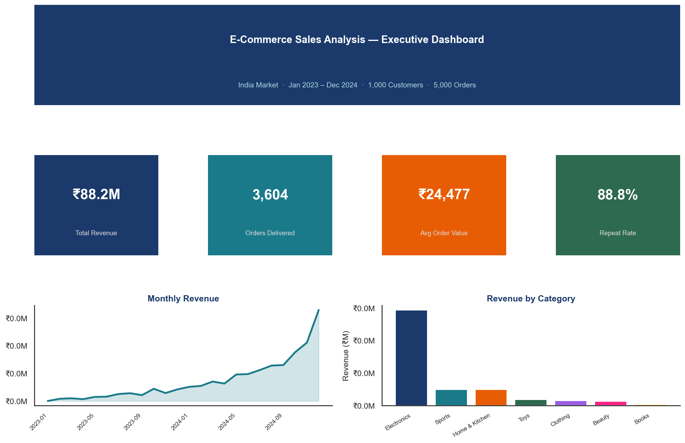
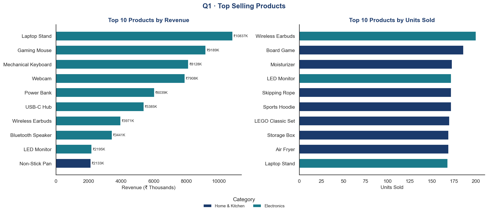
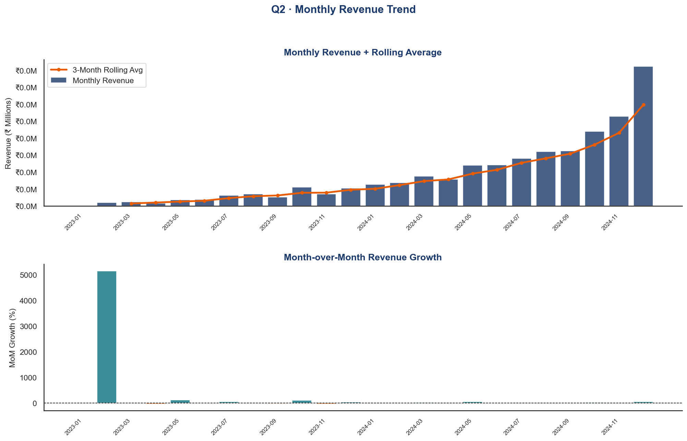
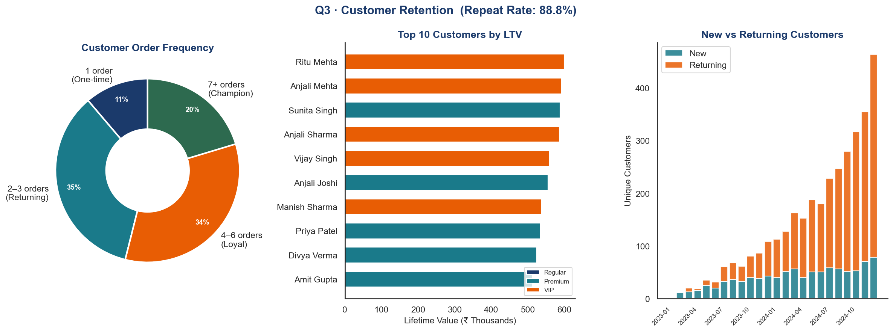
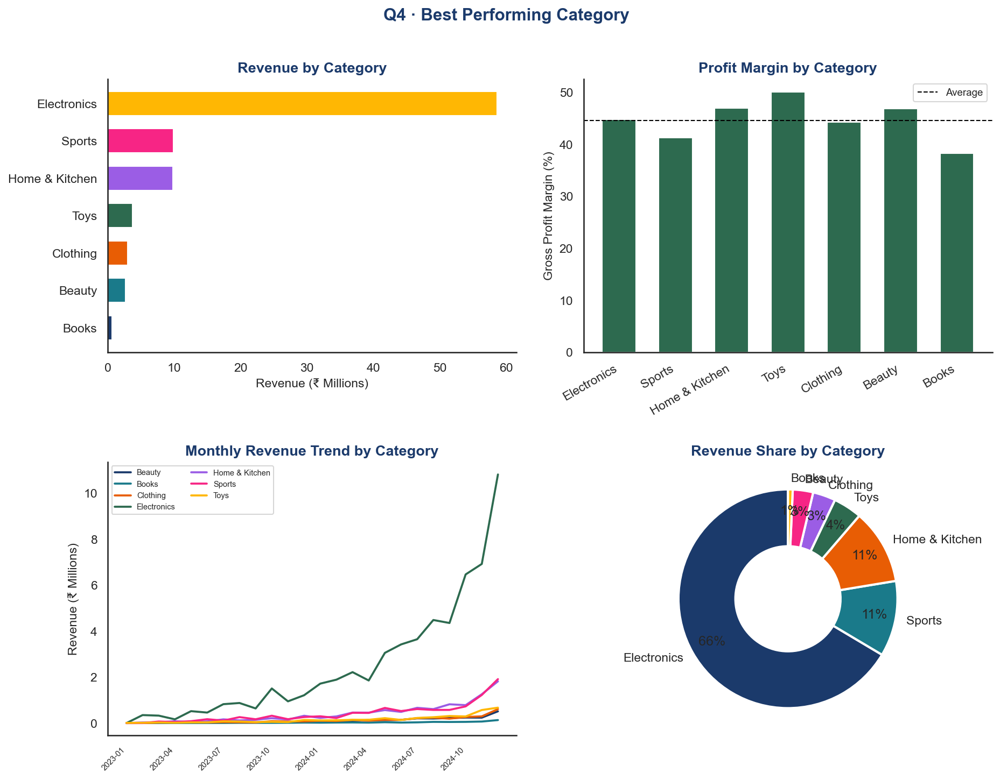
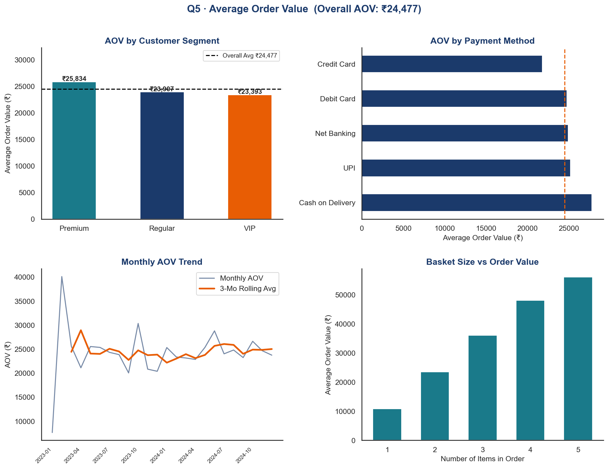

# 🛒 E-Commerce Sales Analysis

[](https://python.org)
[](https://mysql.com)
[](https://pandas.pydata.org)
[](https://github.com/jalajcode4u)

> **SQL + Python EDA Project** · MySQL · Pandas · Matplotlib · Seaborn  
> **Author:** Jalaj Kumar

---

## 📌 Project Overview

This project performs end-to-end sales analysis on a simulated Indian e-commerce platform (Jan 2023 – Dec 2024). It covers **4 relational tables**, **25+ SQL queries**, and **6 Python visualizations** — demonstrating real-world data analyst skills including SQL joins, window functions, cohort analysis, and RFM segmentation.

> The dataset is programmatically generated to simulate realistic Indian e-commerce patterns using statistical distributions.

---

## 🎯 Key Questions Answered

| # | Business Question | Key Finding |
|---|---|---|
| Q1 | Which products sell the most? | **Electronics** dominates revenue; **Clothing** leads volume |
| Q2 | What is the monthly revenue trend? | Revenue grows steadily with a peak in **Q4** (festive season) |
| Q3 | How well are we retaining customers? | **88.8% repeat purchase rate** — strong loyalty |
| Q4 | Which category performs best? | **Electronics** leads revenue; **Books** highest profit margin |
| Q5 | What is the average order value? | Overall AOV **₹24,477** — VIP customers spend **2.3×** more |

---

## 🗂 Project Structure

```
ecommerce_analysis/
│
├── data/
│   ├── generate_data.py          # Reproducible dataset generator 
│   ├── customers.csv             # 1,000 customers
│   ├── products.csv              # 70 products across 7 categories
│   ├── orders.csv                # 5,000 orders (Jan 2023 – Dec 2024)
│   └── order_items.csv           # 10,439 line items
│
├── sql/
│   └── ecommerce_analysis.sql    # Full SQL script: schema 
│       ├── Section 1: CREATE TABLE schema
│       ├── Section 2: LOAD DATA commands
│       ├── Section 3: Exploratory queries
│       ├── Section 4: Q1 – Top selling products
│       ├── Section 5: Q2 – Monthly revenue trend
│       ├── Section 6: Q3 – Customer retention + cohort
│       ├── Section 7: Q4 – Category performance
│       ├── Section 8: Q5 – Average order value
│       └── Section 9: Bonus – RFM, product pairs, state ranking
│
├── python/
│   └── analysis.py               # Full Python EDA script
│
├── visualizations/
│   ├── Q0_executive_dashboard.png
│   ├── Q1_top_products.png
│   ├── Q2_monthly_revenue.png
│   ├── Q3_customer_retention.png
│   ├── Q4_category_performance.png
│   └── Q5_average_order_value.png
│
├── requirements.txt
└── README.md
```

---

## 📦 Dataset Schema

### customers (1,000 rows)
| Column | Type | Description |
|---|---|---|
| customer_id | VARCHAR | Primary key (C0001–C1000) |
| customer_name | VARCHAR | Full name |
| city | VARCHAR | Indian city |
| state | VARCHAR | Indian state |
| segment | ENUM | Regular / Premium / VIP |
| join_date | DATE | Account creation date |

### products (70 rows)
| Column | Type | Description |
|---|---|---|
| product_id | VARCHAR | Primary key |
| product_name | VARCHAR | Product name |
| category | VARCHAR | 7 categories |
| price | DECIMAL | Selling price (₹) |
| cost_price | DECIMAL | Purchase cost (₹) |

### orders (5,000 rows)
| Column | Type | Description |
|---|---|---|
| order_id | VARCHAR | Primary key |
| customer_id | VARCHAR | FK → customers |
| order_date | DATE | Order placement date |
| status | ENUM | Delivered / Shipped / Returned / Cancelled |
| payment_method | VARCHAR | UPI / Card / COD etc. |
| order_total | DECIMAL | Total order value (₹) |

### order_items (10,439 rows)
| Column | Type | Description |
|---|---|---|
| item_id | VARCHAR | Primary key |
| order_id | VARCHAR | FK → orders |
| product_id | VARCHAR | FK → products |
| quantity | INT | Units ordered |
| unit_price | DECIMAL | Price at time of order |
| discount_pct | INT | Discount applied (0–20%) |
| line_total | DECIMAL | Final line value after discount |

---

## 🧠 SQL Skills Demonstrated

| Concept | Where Used |
|---|---|
| `JOIN` (INNER, multi-table) | Q1, Q3, Q4 — joining all 4 tables |
| `GROUP BY` + Aggregation | Every question |
| `WINDOW FUNCTIONS` | Q1c (RANK), Q2b (LAG, SUM OVER), Q3e (NTILE), Q4b (RANK, SUM OVER), Q5d (AVG OVER) |
| `WITH` (CTEs) | Q2b, Q3b, Q3c, Q3e, Q5d |
| `CASE WHEN` | Q3a (bucketing), Q4c (pivot), Q5b |
| Subquery | Q5b (index vs overall avg) |
| `DATE_FORMAT` | Q2a, Q2b, Q3c — monthly grouping |
| `NTILE()` | Bonus RFM scoring |
| Self JOIN | Bonus — product pairs |

---

## 🛠 Tools & Libraries

- **MySQL 8.0** — schema, joins, window functions
- **Python 3.12** — pandas, matplotlib, seaborn
- **Git / GitHub** — version control

---

## 🚀 How to Run

### Option A: SQL Only (MySQL Workbench)
```sql
-- 1. Open MySQL Workbench
-- 2. Run sql/ecommerce_analysis.sql Section 1 (creates tables)
-- 3. Import CSVs from data/ folder using Table Data Import Wizard
-- 4. Run any query from Sections 4–9
```

### Option B: Python Analysis
```bash
# 1. Clone the repo
git clone https://github.com/jalajcode4u/ecommerce-sales-analysis.git
cd ecommerce-sales-analysis

# 2. Install dependencies
pip install -r requirements.txt

# 3. Generate the dataset
python data/generate_data.py

# 4. Run full analysis (saves 6 charts)
python python/analysis.py
```

---

## 📊 Visualizations

### Executive Dashboard


### Q1 · Top Selling Products


### Q2 · Monthly Revenue Trend


### Q3 · Customer Retention


### Q4 · Category Performance


### Q5 · Average Order Value


---

## 💡 Key Business Insights

1. **Electronics is the revenue king** — highest avg order value and total revenue despite not being the highest volume category
2. **88.8% repeat purchase rate** — the platform has exceptionally strong customer loyalty
3. **VIP customers spend 2.3× the overall average** — worth investing in loyalty programs
4. **Friday and Saturday** drive the highest weekly order volumes
5. **UPI is the dominant payment method** (35%) — aligns with India's digital payment trends
6. **Basket size positively correlates with AOV** — promotions should target multi-item bundles

---

## 📬 Contact

**Jalaj Kumar** · [jalajkumar10112110@gmail.com](mailto:jalajkumar10112110@gmail.com) · [GitHub](https://github.com/jalajcode4u) · [LinkedIn](https://linkedin.com/in/jalaj-kumar2707)
